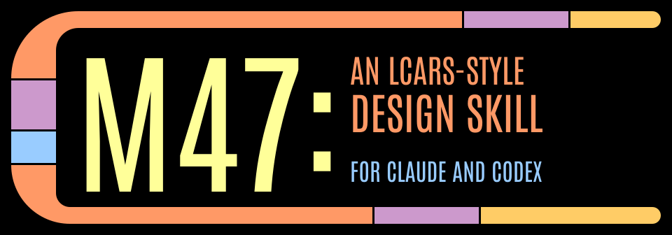
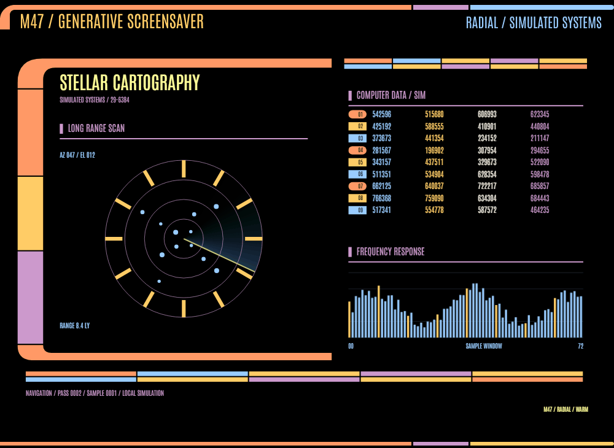
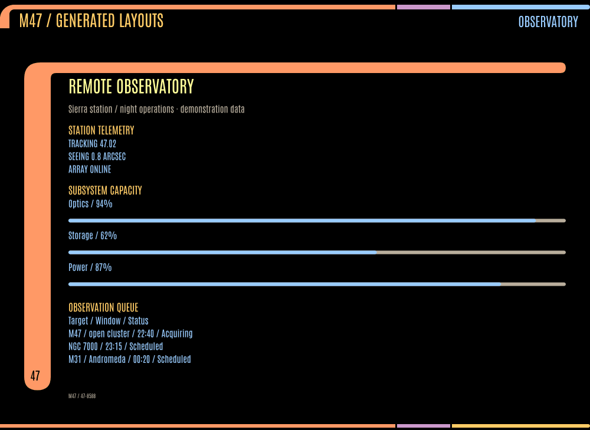
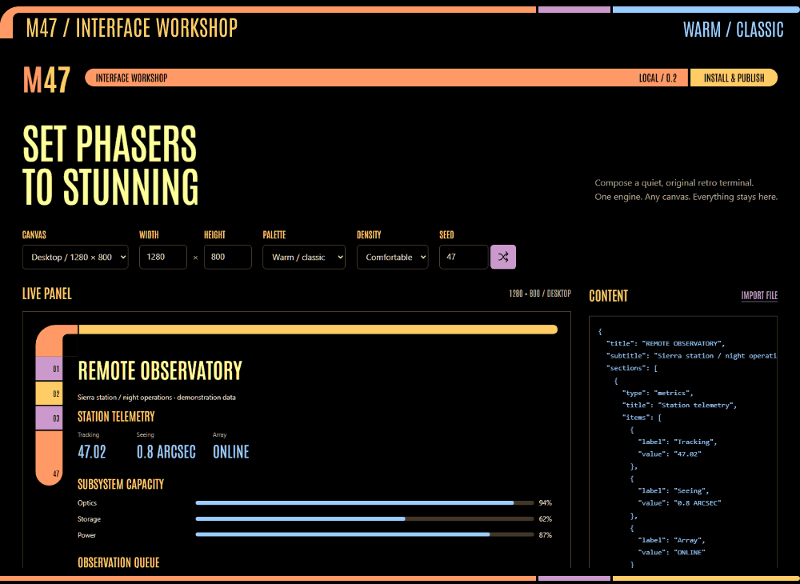
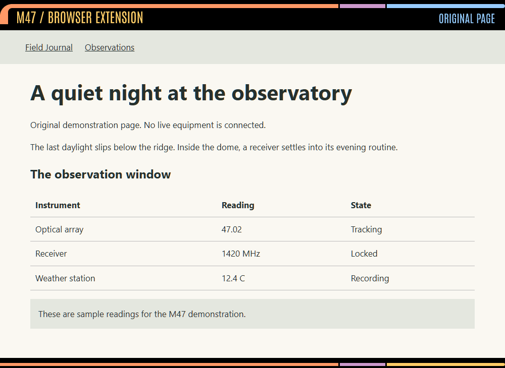
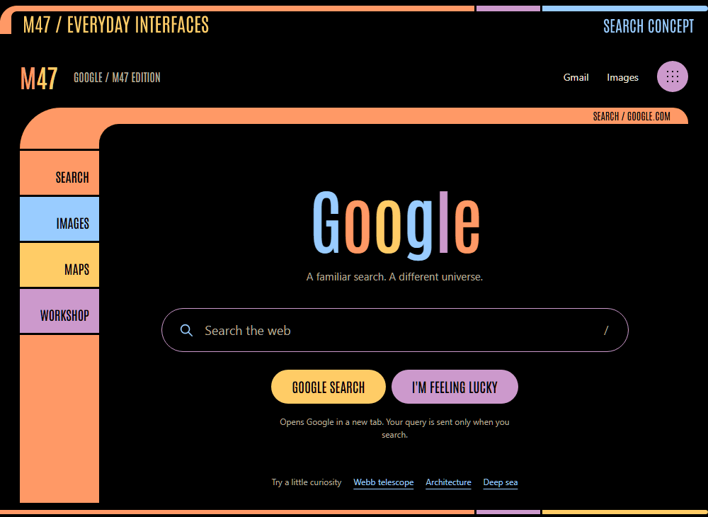
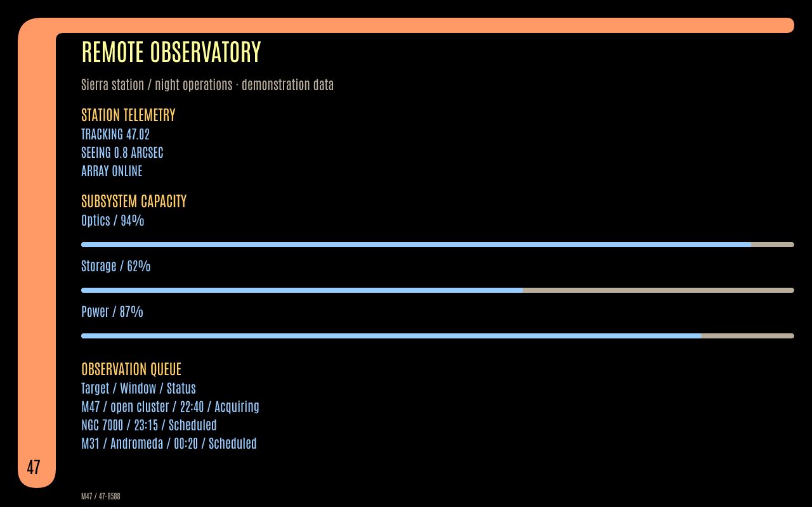

<h1></h1>

[](LICENSE)
[](package.json)
[](#start-here)

M47 is a shared design engine with a CLI, browser workshop, agent skill, page
restyler, new-tab dashboard, and browser themes. Black space, warm curved frames,
Antonio display type, and cool data. All example readings are demonstration data.

**[Animated demos](#animated-demos) · [Start here](#start-here) · [Engine & CLI](#use-the-engine-or-cli) · [Browser builds](#install-browser-builds) · [Agent skill](#agent-skill)**

<a name="animated-demos"></a>
<h2></h2>

Five short loops from M47's working interfaces. All instrument readings are
demonstration data. Expand a preview to watch; each includes a still-image link.

<details open>
<summary><strong>Generative screensaver — radial scanner, reactor column, bridge stations</strong></summary>

<picture>
  <source media="(prefers-reduced-motion: reduce)" srcset="docs/assets/demo-screensaver.png">
  
</picture>

Moving scans, instrument traces, and changing compositions in the
[generative screensaver](docs/SCREENSAVER.md). [View a still](docs/assets/demo-screensaver.png).

</details>

<details>
<summary><strong>Generated layouts — observatory, field notes, wide console, widget, instrument log</strong></summary>

<picture>
  <source media="(prefers-reduced-motion: reduce)" srcset="docs/assets/demo-layouts.png">
  
</picture>

One engine, different content and canvas sizes. These are the
[bundled example specifications](core/examples.js). [View a still](docs/assets/demo-layouts.png).

</details>

<details>
<summary><strong>Interface workshop — palettes, live preview, and composition selection</strong></summary>

<picture>
  <source media="(prefers-reduced-motion: reduce)" srcset="docs/assets/demo-workshop.png">
  
</picture>

Edit structured content, explore the palette, and export your panel from the
[local workshop](#start-here). [View a still](docs/assets/demo-workshop.png).

</details>

<details>
<summary><strong>Browser extension — original page, Full, Palette, Reader, and Off</strong></summary>

<picture>
  <source media="(prefers-reduced-motion: reduce)" srcset="docs/assets/demo-extension.png">
  
</picture>

A local demonstration page running through the [browser extension](#install-browser-builds).
The page's content stays intact. [View a still](docs/assets/demo-extension.png).

</details>

<details>
<summary><strong>Everyday interfaces — search concept and new-tab dashboard</strong></summary>

<picture>
  <source media="(prefers-reduced-motion: reduce)" srcset="docs/assets/demo-interfaces.png">
  
</picture>

LCARS-inspired controls on familiar surfaces: an unofficial
[search concept](docs/GOOGLE-DEMO.md) and the separate new-tab dashboard.
[View a still](docs/assets/demo-interfaces.png).

</details>

<h2></h2>

| Make something with M47 | Start with |
|---|---|
| Compose a panel and export HTML, SVG, PNG, or CSS | [Browser workshop](#start-here) |
| Generate a layout from JSON, Markdown, or HTML | [Engine & CLI](#use-the-engine-or-cli) |
| Restyle pages, a new tab, or your browser colors | [Browser builds](#install-browser-builds) |
| Give an agent the engine, letterforms, and design rules | [M47 skill](#agent-skill) |
| Turn a display into an animated instrument console | [Generative screensaver](docs/SCREENSAVER.md) |

<a name="start-here"></a>
<h2></h2>

Requires Node 22+ and npm.

```sh
npm ci
npm run build
npm run dev
```

Open http://127.0.0.1:4747. Choose a gallery example, edit its JSON, and export
HTML, SVG, PNG, or theme CSS. Drafts stay on your device. Share links contain the
panel itself in the URL fragment; anyone receiving one can read its contents.

<details>
<summary><strong>Explore the included demos</strong></summary>

Try the additional Google-inspired search concept at `/google.html`. It applies
M47's design to a familiar search page and opens real Google results in a new tab.
The `/youtube.html` example provides a curated NASA video collection, topic
filters, click-to-load YouTube players, and a Watch Later list stored on this device.

The [generative screensaver](docs/SCREENSAVER.md) at `/screensaver.html` cycles
twelve simulated purposes through orbital maps, spectra, grids, networks,
waveforms, and system diagrams. Eight frame compositions and eight palettes include
nested scanners, twin workstations, radial displays, and reactor columns. Frames
animate in; instruments stay in motion. Optional USGS earthquake and NOAA space-weather
observations appear in a separate, timestamped band. Adjust layout, motion, brightness,
and timing, then enter fullscreen. A native Windows `.scr` package is available with
`npm run build:screensaver` after the normal build; see the guide for installation.

</details>

<details>
<summary><strong>See a generated panel</strong></summary>



The bundled Observatory example. [Explore the example specifications](core/examples.js).

</details>

<a name="use-the-engine-or-cli"></a>
<h2></h2>

```sh
node cli/index.js generate --spec dist/example.json --out panel.html
node cli/index.js generate --spec dist/example.json --out panel.svg
node cli/index.js generate --spec dist/example.json --out panel.png
node cli/index.js generate --title "Field notes" --content notes.md --out notes.html
node cli/index.js generate --from-html article.html --out reader.html
node cli/index.js check panel.html
```

Add `--size 600x1000 --seed 47 --scheme tng-early --density compact` as needed.
HTML is self-contained with its font and retains long content by scrolling.
SVG/PNG are fixed canvases and return an error if the content needs more space.
`--force` explicitly replaces an existing file. Run `--help` for all options.

```js
import { solve, render, renderSVG } from '@petehottelet/m47';
const spec = {title: 'STATION 47', sections: [{title: 'Notes', text: 'Ready.'}]};
const html = render(spec, {width: 1280, height: 800, seed: '47'});
```

The package name above is configured for publication, not a claim that it is on
npm yet. From this checkout, import `./core/index.js`. Library callers can pass
`fontData` as a base64 TTF data URL; the CLI embeds Antonio automatically.

<a name="install-browser-builds"></a>
<h2></h2>

Run `npm run build` first. Load the **built** directory, not the source directory.

| Surface | Chrome / Edge / Brave | Firefox 140+ |
|---|---|---|
| Page restyler + Reader | `dist/chrome` | `dist/firefox/manifest.json` |
| Separate new-tab dashboard | `dist/newtab-chrome` | `dist/newtab-firefox/manifest.json` |
| Browser color theme | `dist/theme-chrome` | `dist/theme-firefox/manifest.json` |

<details>
<summary><strong>Loading extensions and using the page restyler</strong></summary>

For Chromium: open `chrome://extensions` (or `edge://extensions`), enable
Developer mode, choose Load unpacked, and select the directory.
For Firefox: `about:debugging` → This Firefox → Load Temporary Add-on → manifest.
Temporary Firefox installation ends on restart; persistent use needs signing.
Grant host access when your browser asks. Restricted browser/store pages cannot
be restyled. Already open pages need one initial refresh after loading an unpacked
extension; subsequent mode changes apply immediately without navigation.

**Full** restyles the page and adds the frame. **Palette** only restyles.
**Off** restores styles still owned by M47, preserving subsequent app edits.
Alt+Shift+L cycles the current site. Use default removes a site override.
Reader extracts a local text view that closes back to the original page.

The page extension needs webpage access. The independent new-tab extension has
no permissions and stores user-entered quick links; it does not read
browser bookmarks. Closed shadow roots, cross-origin frames, fixed-position app
chrome and some CSS-generated content remain compatibility limits.

</details>

<a name="agent-skill"></a>
<h2></h2>

Use the [M47 skill](skill/m47/SKILL.md) to create original interfaces with the same
Antonio letterforms, semantic palette, curved frames, and shared engine.

Extract `dist/m47-v0.2.0-skill.zip`. Its `m47` folder includes `SKILL.md`, the
engine/CLI, font, token/CSS references, examples, and a conformance rubric.
Put the folder in the agent's skills directory. See [publishing](docs/PUBLISHING.md)
for installation paths. HTML/SVG generation needs only Node 22; PNG and local HTML
extraction use the packaged npm dependencies.

<a name="validate-and-release"></a>
<h2></h2>

```sh
npm run check
npm pack --dry-run
```

CI builds on Windows, macOS, and Linux and runs Chromium/Firefox browser tests.
`npm run build` produces eight ZIP bundles plus `dist/SHA256SUMS.txt`.
The draft-release and website workflows run only when manually dispatched.

README artwork is built from the bundled Antonio font and `core/tokens.json`.
Run `npm run build:readme` to regenerate the outlined SVG title, section labels,
and version badges. The images require no installed fonts or external services.
Run `npm run build:readme-demos` to recapture the five GIFs and their still previews;
this optional command needs the Playwright Chromium browser and FFmpeg on `PATH`.
It builds isolated capture copies and uses local sample content without live feeds.
Append `-- --screensaver-only` to refresh only the screensaver animation and still.

- [Publishing guide](docs/PUBLISHING.md): exact files, commands, account gates,
  Chrome/Firefox/Edge, npm, agent skills, static hosting, PWA, themes.
- [Improvement spec](docs/IMPROVEMENTS.md): initial rating and implementation gates.
- [Assessment](docs/ASSESSMENT.md): final rating, evidence, and remaining work.
- [Original PRD](docs/PRD.md): historical research and longer-term targets.
- [Privacy policy](PRIVACY.md): what stays local and what sharing means.

<a name="credits-and-license"></a>
<h2></h2>

Source repository: **private**. Code and original project documentation: **MIT**.
Antonio remains under SIL OFL. Public hosting, npm, and store publication are
separate steps; no public distribution is implied by this repository.

M47 generates original compositions inspired by the LCARS interface language
created by Michael Okuda. Unofficial fan-made project; not affiliated with CBS
Studios, Paramount, or any rights holder. STAR TREK and related marks belong to
their respective owners. No copied screen panels, show audio, or official insignia
are bundled. This does not establish rights clearance for the visual style.

Code and original project docs: [MIT](LICENSE). Antonio: [SIL OFL](extension/fonts/OFL.txt).
M47 is offered free without ads or paid tiers; that operating choice adds no
non-commercial restriction to MIT. See [NOTICE](NOTICE) for attribution and contacts.
