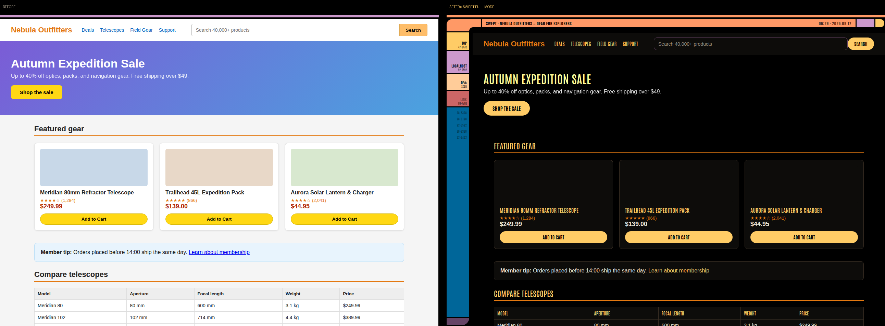

# M47

**Browse the web as a calm retro sci-fi terminal.** Black ground, warm curved
chrome, pill buttons, condensed uppercase type — a browser extension that
dynamically re-renders any site, inspired by the LCARS interface style created
by Michael Okuda for *Star Trek: The Next Generation*.

> STAR TREK® and related marks are trademarks of CBS Studios Inc. M47 is an
> unofficial, non-commercial, open-source fan/art project — not affiliated
> with, endorsed by, or sponsored by CBS Studios, Paramount Skydance, or any
> rights holder. No show assets are used: all layouts are generated, the font
> is the open-licensed Antonio (SIL OFL), and no data ever leaves your browser
> (see [PRIVACY.md](PRIVACY.md)).

## Install (Chrome / Edge / Brave) — 60 seconds

1. **Code → Download ZIP** (green button above), unzip somewhere permanent.
2. Open `chrome://extensions`
3. Toggle **Developer mode** on (top-right).
4. Click **Load unpacked** → select the `extension/` folder.
5. Browse anywhere. Click the M47 toolbar icon to set modes.

### Firefox

1. Copy `firefox/manifest.json` over `extension/manifest.json` (or run `./build.sh`
   and use the firefox zip).
2. `about:debugging` → **This Firefox** → **Load Temporary Add-on** → pick the
   manifest. (Temporary add-ons unload on restart; a signed build via AMO
   self-distribution fixes that — see [docs/PUBLISHING.md](docs/PUBLISHING.md).)
3. After loading: right-click the toolbar icon → **Always Allow on Every Site**.

## Modes

| Mode | What you get |
|---|---|
| **FULL** | Dynamic restyle + frame chrome: side rail (scroll-to-top, hostname, scan % tracking your scroll, numeric cascade — one 47 always seeded), top bar with page title and clock |
| **PALETTE** | Restyle only: black ground, warm palette, golden links, pill controls, themed scrollbars |
| **OFF** | Hands off this site |

Per-site memory; **Alt+Shift+L** cycles the current site. Heavyweight web apps
may keep a few unconverted corners — that's what PALETTE/OFF are for.

## Project

- [docs/PRD.md](docs/PRD.md) — the full product requirements: research-backed
  design spec (geometry, color, type, motion, sound), the agent-skill / CLI /
  website / extension roadmap, and the legal posture.
- [docs/PUBLISHING.md](docs/PUBLISHING.md) — store submission playbook + IP notes.
- `store-assets/` — submission-ready screenshots and promo tiles.
- `./build.sh` — produces the Chrome and Firefox zips.

## License

Code is [MIT](LICENSE). Antonio font © Vernon Adams, [SIL OFL](extension/fonts/OFL.txt).
Docs CC BY-SA 4.0. The MIT license covers this code only and cannot and does
not grant rights in any third party's designs or marks.
